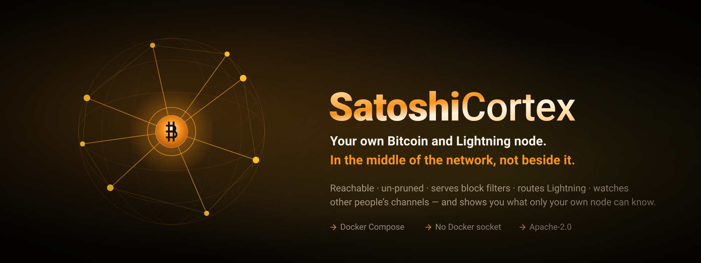
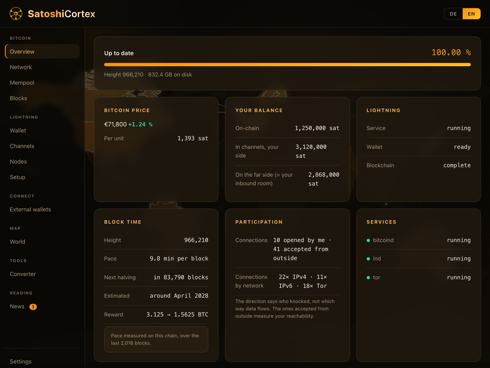
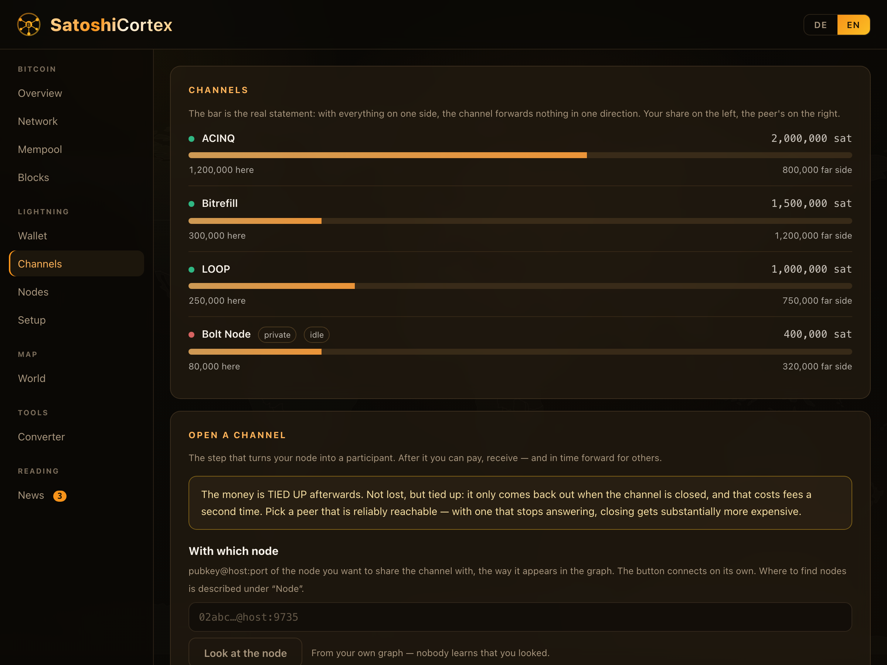
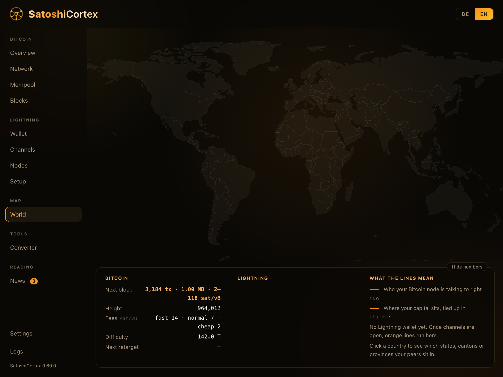
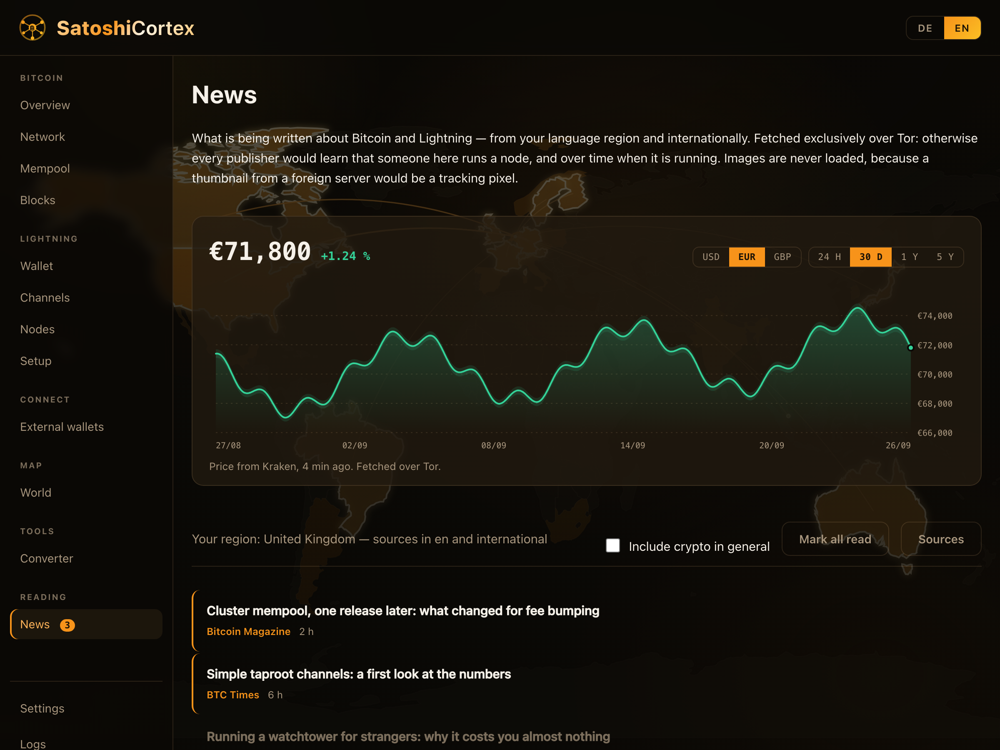
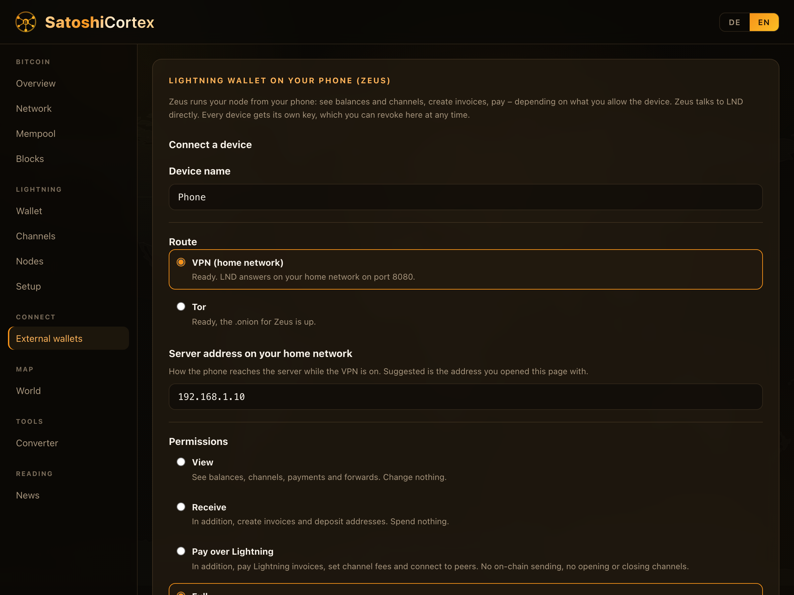
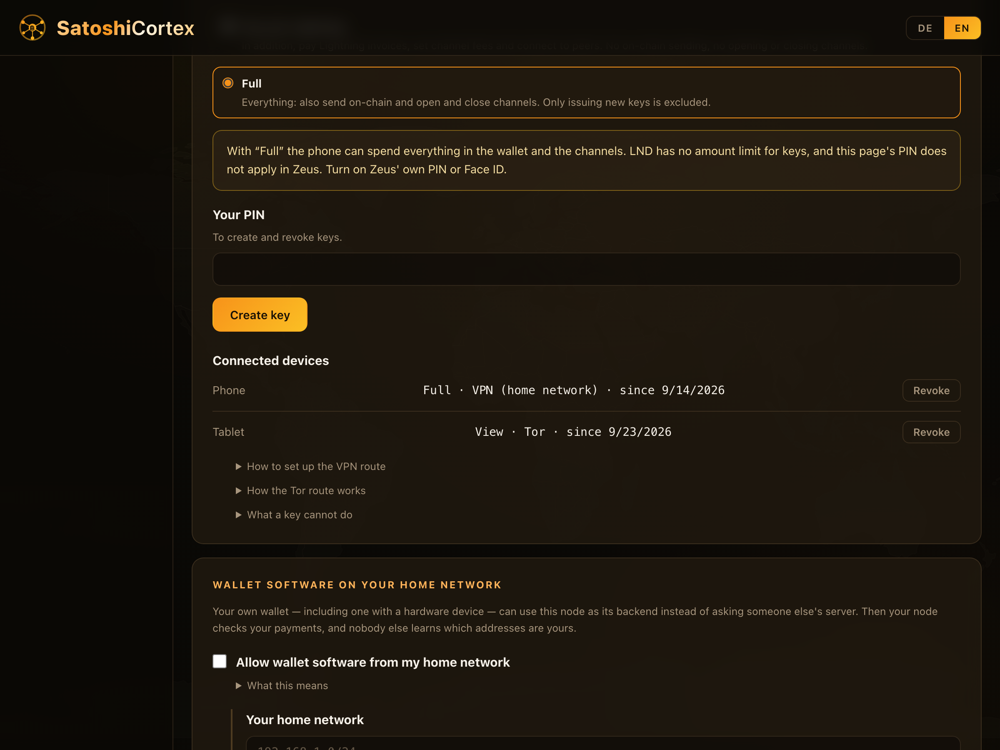
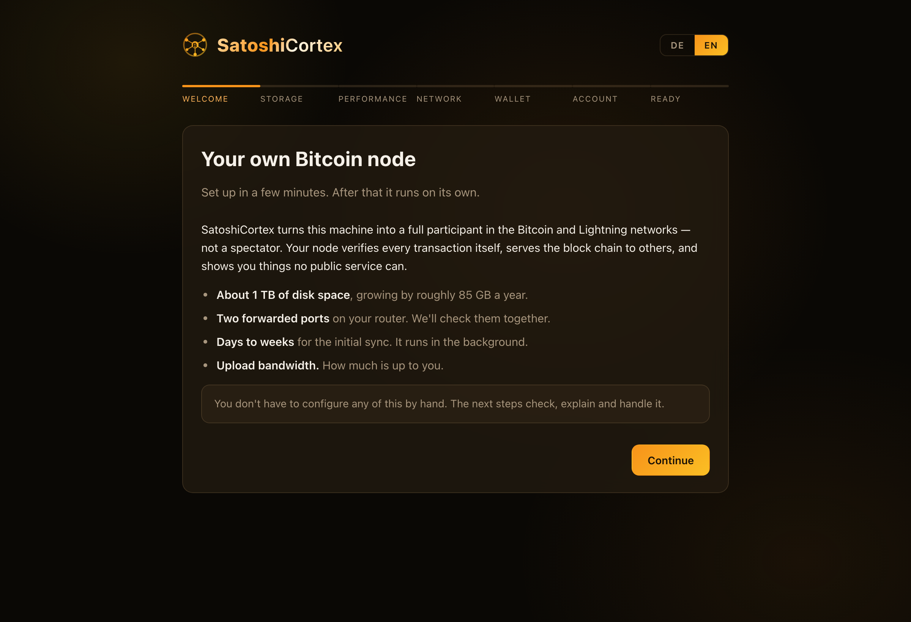
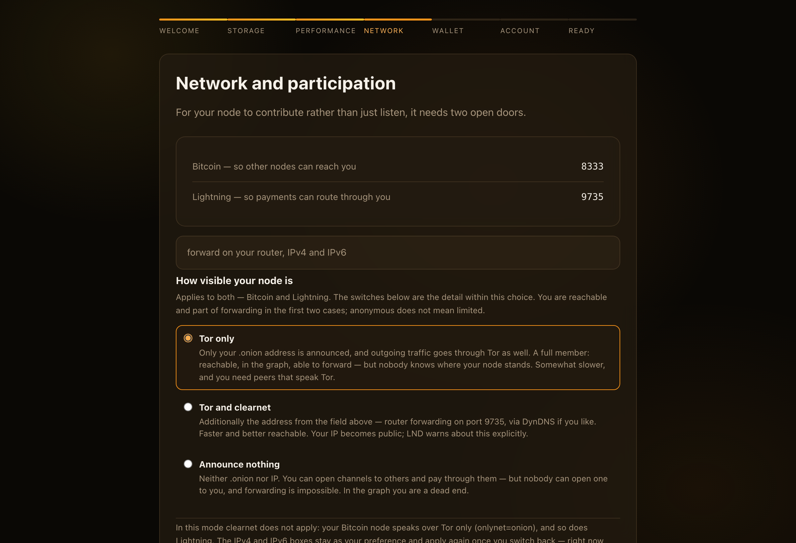

<p align="center">
  
</p>

<p align="center">
  <a href="LICENSE"></a>
  <a href="https://github.com/IkarusMK/satoshicortex/releases"></a>
  <a href="https://github.com/IkarusMK/satoshicortex/actions/workflows/check.yml"></a>
  
  
  
  
</p>

<p align="center"><b>A full Bitcoin and Lightning node that takes part in the network — and shows you what only your own node can know.</b></p>

SatoshiCortex is **not another self-hosted block explorer.** It is a complete
Bitcoin and Lightning node, packaged so that a person who has never edited a
`bitcoin.conf` can run one — and built so that the node is a **contributing
member** of both networks rather than a spectator.

Two ideas carry the whole project:

1. **It takes part.** Reachable from the internet, un-pruned, serving BIP158
   filters to light wallets, bridging Tor and clearnet, routing Lightning
   payments for strangers and watching other people's channels.
2. **It shows what only it can know.** Your mempool with its real purge
   feerate. Your own first-seen timestamps. Why *your* Lightning route failed.
   No public explorer can answer those, because they are not questions about
   Bitcoin — they are questions about **your** node.

> [!WARNING]
> SatoshiCortex manages real money in a hot wallet on a machine that is
> reachable from the internet. The software comes with **no warranty of any
> kind**. Your keys are your responsibility. Choose an amount whose total loss
> you could live with.

## Highlights

**⚡ A node that contributes, not just observes**
- **Reachable** on port 8333 — the majority of Bitcoin nodes are not, and sit
  behind NAT taking without giving
- **Archive node** (`prune=0`) — serves newcomers the chain from block 0
- **Block filter server** (`blockfilterindex` + `peerblockfilters`) — light
  wallets can ask *you* instead of a corporate server
- **Tor bridge** — clearnet stays on, so Tor-only nodes reach the rest
- **Lightning routing** with public channels, and a **watchtower** that
  protects channels belonging to people you will never meet

**🔭 What only your own node knows**
- **Your mempool, not "the" mempool** — real policy, so you see the actual
  purge feerate your transaction has to survive
- **First-seen timestamps** over `zmqpubsequence` with a monotonic counter, so
  lost messages are detectable — and the **dwell time** of every transaction
  falls out of it
- **The cluster-mempool feerate diagram** from Core 31 — the curve miners
  optimise against, and the measure every RBF replacement is judged by. No
  public explorer shows it.
- **Why a Lightning route failed** — not just *that* it did, but the wire
  failure code, so the dashboard becomes an operating tool

**🌍 A world map of the network you are actually in**
- Every peer and every Lightning channel partner placed on the map, with
  connection lines running from **your** node outward
- **Click any country** to zoom into its regions — states, cantons, provinces
  — for all 241 countries, not just a favoured few
- Resolved locally against a bundled IP-to-place table: **no lookup service,
  no API key, nothing leaves the machine**

**📰 Bitcoin news, without being counted**
- A curated feed of **37 measured sources in 12 languages**, with 85 countries
  mapped to a language — because there is no Algerian Bitcoin press, but there
  is a French one, and Algeria reads French
- The Bitcoin **price with history** (24 h to 5 years, USD/EUR/GBP), with a
  crosshair that reads out time, price and the day's range
- **Everything fetched over Tor.** A feed reader on your own machine tells
  every publisher daily that someone at this address follows Bitcoin — and
  over months, when they are awake
- **No remote images, ever** — a thumbnail from a publisher's server is a
  tracking pixel that would undo the Tor detour in the same second

**📱 Your node in your pocket — on your terms**
- **Zeus on your phone**, connected over **Tor** or over **your router's VPN**
  — the only two routes on offer. Nothing is opened to the internet.
- **Every device gets its own key**, with the permissions you choose: view,
  receive, pay over Lightning, or full. Each one can be revoked on its own, at
  once, without touching any other.
- The key is shown **once**, as a QR code and as text, and never stored. Even
  *full* may not issue new keys, so a stolen phone cannot mint itself a
  replacement that survives its revocation.
- Sparrow and hardware wallets use the same tab: your node as their backend,
  released for your home network only.

**📦 Set up by a wizard, not by a manual**
- `cp example.env .env` → `docker compose up -d` → open the browser. That is
  the whole procedure.
- The wizard checks free space, sizes the performance limits, **tests your
  port forwarding live**, and explains what the upload budget really means
- Everything that used to be handwork happens inside the application: RPC
  credentials, directory layout, `bitcoin.conf`, waking the services in order
- **German and English**, switchable at any moment

**🔒 Built for a machine that holds keys**
- **No Docker socket.** On a device with a wallet that is equivalent to root.
  Services are woken through config files instead — and a service can be
  switched off by taking its permission away.
- **A PIN guards every step with consequences.** Sending on-chain, opening and
  closing a channel, paying an invoice, moving liquidity between your own
  channels, issuing or revoking a key for an external wallet and deleting the
  wallet all ask for it, and it is checked *before* anything else. Five wrong
  tries lock it for fifteen minutes; the counter lives in a file and survives a
  restart. Setting it up requires the account password, so a hijacked session
  cannot hand itself the key.
- **The application can send on-chain — and that is a deliberate trade.** Its
  macaroon carries `onchain:write`, because a wallet you cannot get out of is
  not a wallet. LND grants *SendCoins* and *OpenChannel* on that same
  permission and does not separate them, and a macaroon knows no amount limit.
  For anyone holding the **disk** this changes nothing — LND's own
  `admin.macaroon` sits there anyway. For a hijacked **session** it changes
  everything, and that is what the PIN is for.
- **What the macaroon still may not do:** `macaroon`, `signer`, `walletrpc`.
  Whoever can bake macaroons can grant themselves anything — that would be
  `admin` by another road. A test keeps the list honest.
- **Paying over Lightning uses `offchain:write` — also a deliberate trade.**
  LND hangs *SendPaymentV2* on the same permission as channel fees, so the
  macaroon that sets fees can also pay. The application uses it to pay
  invoices, to move liquidity between its own channels and to open channels —
  all behind the PIN. Whoever holds the macaroon **file** could pay without
  one, but then they hold the disk, and `admin.macaroon` with it.
- Own images only, **built from official releases with signature
  verification** — Core against at least three independent Guix builder
  signatures, LND against Lightning Labs' pinned key, Tor from the project's
  own APT repository
- The wallet seed goes **on paper**, with a forced read-back. Never to disk,
  never into a vault, never into a chat.
- **Sign in with [Pocket ID](https://pocket-id.org) or any OIDC provider** —
  passkeys instead of a password, and SatoshiCortex speaks OpenID Connect
  itself, so there is no second login form behind the first one. Your provider
  decides who may in. The local account stays as an emergency door that only
  opens on your own network.
  [How to set it up →](#protect-it-with-pocket-id-or-any-oidc-provider)

## How it works

```
                    Sparrow (Desktop) ──┐
                                        │ RPC, txindex
Tor ── bitcoind ────────────────────────┤
         │  ▲                           │
    RPC/ZMQ  │ writes config            │
         ▼  │                           │
       SatoshiCortex (app, :3333) ───────┘
         │
         └── LND ──(9735)── Lightning network
```

**Four containers**: `app`, `bitcoind`, `lnd`, `tor`. That is all — the news
feed, the price ticker, the map and the analysis all run as background tasks
**inside** the application, not as extra services.

There is no Electrum server: Sparrow and friends connect straight to Bitcoin
Core (Settings → Server → Bitcoin Core), and with `txindex` they gain
functions that would otherwise require one.

A phone wallet can attach: **Zeus**, under *External wallets*, over Tor or
over your router's VPN — nothing else. Every device gets its own key with the
permissions you choose (view, receive, pay over Lightning, or full), and you
can revoke each one on its own. Off until you add a device. One thing to know
before choosing "full": an LND macaroon cannot carry a spending limit, so a
key that may move money may move all of it.

Open to the internet: **8333** and **9735** — the two ports that are *supposed*
to be open, because they are how you take part. On the LAN: **3333** for the
web interface — and LND's REST port only if you switch on the VPN route for
external wallets. RPC, ZMQ and gRPC never leave the compose network.

**Tor holds the onion services itself.** Three of them — Bitcoin, Lightning and
the watchtower, each with its own address — defined in Tor's own configuration
and pointing at the fixed addresses of `bitcoind` and `lnd` in the compose
network. Tor recreates them on every start, whoever restarts when, and there is
no Tor control port at all. Letting bitcoind and LND create them through
that control port without naming a target, so Tor forwarded to `127.0.0.1` in
*its own* container, where nothing listens: the addresses were announced and
unreachable. *Node → Reachability* now measures all three from outside.

## What it looks like

Dark, dense, tabular — built to be read at a glance, not to be pretty in a
screenshot. German and English, switchable at any moment; the toggle sits top
right.

**The overview.** Chain progress, the price, your balance split three ways,
Lightning state, and what your node actually contributes to the network.

<p align="center">
  
</p>

**Your channels.** The bar is the real statement: with everything on one side,
the channel forwards nothing in that direction. Your share on the left, the
peer's on the right.

<p align="center">
  
</p>

**The world map.** Where the peers you are talking to actually sit — and,
once channels are open, where your capital is tied up. Below it the numbers
only your own node can give: what *your* mempool would put in the next block.

<p align="center">
  
</p>

**The news feed.** Fetched exclusively over Tor, because otherwise every
publisher would learn that someone here runs a node. Images are never loaded —
a thumbnail from a foreign server is a tracking pixel.

<p align="center">
  
</p>

**External wallets.** Zeus on your phone, over Tor or over your router's VPN.
Every device gets its own key with the permissions you pick — and the page
says plainly what a key cannot do: LND knows no spending limit, and this
page's PIN does not reach into Zeus.

<p align="center">
  
</p>

**One key per device, revocable on its own.** The key is shown once as a QR
code; afterwards the list is all that remains, with a button that makes that
one key worthless at once.

<p align="center">
  
</p>

### Setting it up

Seven steps, none of which assume you know Bitcoin. The one real decision is
how visible your node is — and there is deliberately **no default** for it.

<p align="center">
  
</p>

<p align="center">
  
</p>

<sub>All screenshots come from a demo instance with example data — the disk
sizes, balances, channels and articles are made up so the interface can be
shown end to end on a laptop. The interface itself is the real one. More
screens under <a href="assets/screenshots/">assets/screenshots/</a>.</sub>

## Requirements

- **~1 TB of disk**, growing ~85 GB a year. Pruning is not an option: `txindex`
  needs the whole chain, and as an archive node this one serves newcomers the
  chain from block 0 — which far from every node can do.
- **A small fast disk helps** — but only ~25 GB of it. Blocks and the large
  indexes may live on the slow one. Only one disk? That works too; the initial
  sync just takes longer.
- **~4 GB RAM** in the default profile. A NAS usually runs other things, so CPU
  **and** memory are hard-capped per service, and you can lower the caps.
- **Two port forwards** in your router: 8333 and 9735, IPv4 and IPv6. The
  wizard explains what they do and tests live whether they arrive. A third,
  **9911**, is optional: it offers your watchtower over clearnet. With Tor
  the tower gets its own onion address and needs no forward.
- **Upload bandwidth.** 300 GB/month by default. Once the budget is spent the
  node stops serving *old* blocks — new blocks and transactions keep flowing
  normally, so you stay fully involved.
- **Only Docker.** No Python, no libraries, no system packages. Architectures:
  **amd64** and **arm64**, detected by the Dockerfiles themselves.

## Getting started

In short:

```sh
cp example.env .env      # a dozen values: paths, ports, limits
docker compose up -d
```

Then open `http://<your-server>:3333` — the default for `WEBUI_PORT` — and the
setup wizard takes it from there.

**Note where the wizard starts.** It can only guide you from step 11 onward,
because until `docker compose up` has run, it isn't running either. Everything
before that is below. On a plain Linux box most of it takes care of itself; on
a NAS it does not, and that is where people get stuck.

### Phase 1 — Prepare the NAS

**1. Create the five directories by hand**, under your two mount points:

    <DATA_BULK>/blocks
    <DATA_BULK>/coreindex
    <DATA_FAST>/bitcoind
    <DATA_FAST>/tor
    <DATA_FAST>/config

NAS compose UIs (UGOS, Synology's Container Manager) check that every bind
mount path already exists and refuse to start otherwise — so the wizard never
gets the chance to create them itself. On the command line this never shows up,
because there Docker creates missing directories on its own.

Two more things: **not directly on the volume root** — UGOS and Synology turn a
directory there into a *shared* folder visible on the network, so use
`/volume1/docker/…` instead of `/volume1/…`. And all of them must be owned by
**UID 1000**, the identity the services run under.

**2. Check that the ports are free:**

```sh
sudo ss -tlnp | grep -E ':(3333|8333|9735)\b'
```

**4080 is the default port of the mempool.space UI** — and people who build
themselves a Bitcoin node often already run it. That is exactly why the default
here is **3333**. Some NAS UIs still display the port mapping even after the
bind failed, which makes the error look like broken software.

**3. Keep only ONE compose file in the project directory.** UGOS writes its own
`docker-compose.yaml` when deploying. If the shipped `docker-compose.yml` sits
next to it, that one wins — Docker searches in a fixed order and `.yml` comes
before `.yaml`. The wrong file gets deployed, **with no error, no container and
no log**.

### Phase 2 — Fill in the .env

**4.** `cp example.env .env`. A dozen values; nothing else is set by hand.

**5. Service identity.** `PUID=1000`, `PGID=1000` — but **on UGREEN and
Synology `PGID=10` belongs here**, because both keep users in the group `users`
with GID 10. Otherwise the block data ends up owned by a group the device does
not have.

**6. The two storage locations.** `DATA_BULK` large and slow (HDD, ~1 TB),
`DATA_FAST` small and fast (SSD, ~25 GB is enough). The shipped defaults point
into the same folder and therefore the same disk — fine for a first try, but on
a NAS with both an HDD and an SSD you give away the whole split, and the ~840 GB
chain may land on the small fast disk.

**7. Ports and resource caps.** `WEBUI_PORT=3333`, `BITCOIN_P2P_PORT=8333`,
`LIGHTNING_P2P_PORT=9735`. **No CPU value may exceed the machine's core count**
— otherwise that container refuses to start and Docker only says `range of CPUs
is from 0.01 to X` without naming the setting it means.

**8. Leave the versions pinned.** Pinned does not mean frozen: Renovate watches
those lines and the build checks daily for new Core and LND releases. **You**
decide when to apply one — there is a wallet on this machine, and an LND
database migration cannot be undone.

**Leave the container network alone, too.** `NETWORK_PREFIX=10.83.33` gives the
containers fixed addresses, and Tor forwards connections that arrive at your
onion addresses to exactly those. Change it only if `docker compose up` reports
*"Pool overlaps with other one on this address space"* — then another network
on your machine already uses that range; pick any other free private /24.

### Phase 3 — Start

**9.** `docker compose up -d`. All four containers start immediately — and
**wait**. Their configuration does not exist yet; it is written by the wizard.
Each service waits until `/config/<name>.conf` *and* `/config/<name>.ready`
exist. That detour exists on purpose: the obvious alternative is handing the
application the Docker socket, and on a machine holding a Lightning wallet that
is equivalent to root.

**10.** Open `http://<your-server>:3333`.

### Phase 4 — The wizard

**11. Click through the seven steps:** Welcome, Storage, Performance, Network
(*the important one — how visible your node is*), Wallet software, Account,
Done. None of them assume you know Bitcoin, and all of them can be changed
later under Settings.

**12. Step 5 needs two things, not one.** For wallet software on your LAN to
actually reach the node, both must be true: the permission in the wizard **and**
`RPC_BIND=0.0.0.0` in your `.env`. The port alone does nothing while
`rpcallowip` blocks it, and vice versa. No wallet is created inside the node and
no key is handed to it — **nobody can move money with this, because there are no
keys in the node.**

### Phase 5 — At the router

**13. Two port forwards, IPv4 and IPv6:** **8333** for Bitcoin, **9735** for
Lightning. Without 8333 the node has 8–10 outbound connections and only *takes*;
without 9735 you can only open outbound channels and are a dead end in the
graph. The wizard measures live whether anyone actually arrives — at the
addresses your node *announces*, which is the question that matters.

Optionally a third: **9911** for your watchtower. With Tor it is not needed —
Tor offers the tower under an onion address of its own. Forward it only if you
also want to offer the tower over clearnet; it is announced that way only in
"Tor and clearnet" mode.

**Over Tor, no forward is needed at all.** In "Tor only" mode your node is
reachable for Bitcoin, Lightning and the watchtower without a single open port
— through the three onion addresses Tor creates.

### Phase 6 — Wait, and then

**14. The initial sync runs in the background**, days to weeks depending on the
machine — the chain is around block 963,000 and ~762 GB. It survives restarts.
Near the end progress grows very slowly, which looks like a hang: as long as the
block height rises, it is working. Under **Logs → SatoshiCortex** a line with
height, share and speed appears every ten minutes.

**15. Set up Lightning once the chain is there.** The overview says so itself.
No second deployment — `lnd` was running and waiting the whole time. Then the
guided flow: create the wallet, **seed on paper** with a forced read-back,
channel backup, alias, first channels. SatoshiCortex never stores those
twenty-four words — not in a file, not in a log, not in its state.

**Beyond that, nothing else is left to do by hand.** No config files to copy, no
password hashes to generate, no permissions to set.

For the internals: [GUIDE.md](GUIDE.md).

Working on this with a coding agent? [AGENTS.md](AGENTS.md) states the
conventions that are easy to mistake for accidents — the source is German on
purpose, every number comes from your own node, and there is no Docker
socket.

## Protect it with Pocket ID (or any OIDC provider)

By default you sign in with a local account. If you run your own OIDC provider
you can sign in with that instead — SatoshiCortex speaks OpenID Connect
**itself**, so there is no second login form behind the first one.

It was built against [Pocket ID](https://pocket-id.org) (passkeys, no
passwords), but nothing here is specific to it: every address is read from the
provider's discovery document, so Authentik, Keycloak and friends work the
same way.

**In your provider**, create an OIDC client and set:

| Field | Value |
|---|---|
| Callback URL | `https://<your-satcortex-domain>/api/anmeldung/oidc/callback` |
| Public client | **on** |
| PKCE | **on** |
| Allowed groups | whoever may sign in — see below |

**In your `.env`:**

```sh
OIDC_ISSUER=https://<your-provider-domain>
OIDC_CLIENT_ID=<from your provider>
OIDC_REDIRECT_URL=https://<your-satcortex-domain>/api/anmeldung/oidc/callback
TLS_EXTERN=true          # a reverse proxy in front terminates TLS
```

`OIDC_CLIENT_SECRET` stays empty for a public client. Pocket ID does not issue
one at all — public clients authenticate with PKCE instead of a shared secret,
and SatoshiCortex always sends PKCE. If your provider *does* issue a secret,
put it in and it will be used.

The login page then offers **Sign in with …** and the password form moves out
of the way.

### Who may sign in

**Your provider decides, not SatoshiCortex.** In Pocket ID a new client allows
*nobody* until you clear a group for it. Keeping a second list of names here
would only be a second truth that drifts from the first one.

### The emergency door

This machine holds a hot wallet. Being locked out of it is not an acceptable
state, so the local account stays — but with the identity provider configured
it only accepts a password from requests that **did not come through a reverse
proxy**.

From the internet there is genuinely only your provider. On your own network
the door back in stays open, for the day the provider is down or a passkey is
lost.

This rests on one assumption: **do not forward the web UI port to the
internet.** Only 8333, 9735 and optionally 9911 belong out there.

### If sign-in loops back to the login page

Every failure is redirected back with a reason (`?anmeldung=…`) and written to
the app log:

| What you see | Usually means |
|---|---|
| `redirect_uri … is not registered` | the callback URL in your provider and `OIDC_REDIRECT_URL` are not identical — they are compared character by character |
| back at the login page, no obvious error | client is **not** marked public while `OIDC_CLIENT_SECRET` is empty |
| `?anmeldung=abgelehnt` | the account is in no group cleared for this client |
| `?anmeldung=abgelaufen` | the attempt took longer than 10 minutes, or the link was opened twice |
| `Ausweis nicht angenommen` in the log | the provider's answer is quoted there in full |

## Contributing

Issues and pull requests are welcome. Two things to know before you start:

- **The comments are in German**, and they explain *why* rather than *what* —
  usually including the measurement or the failure that led to the decision.
  Keep that habit and your patch will fit right in.
- **Every guard is verified by re-introducing the bug it guards against.** A
  test that stays green when the fault is put back is not a test.

Everything runs locally:

```sh
cd app/backend && python3 -m pytest        # 779 tests
python3 tools/i18n_pruefen.py              # translation completeness
python3 tools/quellen_pruefen.py           # measure the news sources
node --check app/web/app.js
```

### Pulling a release

Images are built by CI and published to GHCR. Set `SATCORTEX_VERSION` in your
`.env` — `latest`, or a pinned version:

```sh
docker compose pull && docker compose up -d
```

**Updating the app does not take your node offline.** `app` depends on no
other service, so only that container is replaced: `bitcoind` and `lnd` keep
running, channels stay open, forwards keep flowing — the web interface is gone
for a few seconds. Only an **LND** update restarts the Lightning node itself
(a minute or two, longer on a database migration), and only a **Bitcoin Core**
update restarts the chain node. The guide has a table of what costs what.

### Verifying what you pull

This project verifies the signatures of Bitcoin Core and LND before it uses
them. You can do the same with ours: every image built from a release carries
a **signed build provenance** — "built by this workflow, from this commit" —
signed through GitHub and Sigstore, with no long-lived key that could leak.

```sh
gh attestation verify oci://ghcr.io/ikarusmk/satcortex:<version> --owner IkarusMK
```

The same works for `satcortex-bitcoind`, `satcortex-lnd` and `satcortex-tor`.
It fails loudly if the image was not built by this repository's workflow.
Releases up to and including 1.2.1 were built before this was in place and
carry no provenance.

## License

Apache-2.0 — see [LICENSE](LICENSE).

The repository contains **no third-party code**: the Dockerfiles *download*
the official binaries at build time and verify their signatures. Attribution
for what the published images contain is in
[THIRD-PARTY-LICENSES.md](THIRD-PARTY-LICENSES.md).

Built on Bitcoin Core, LND and Tor. Authorship of those is not claimed.
